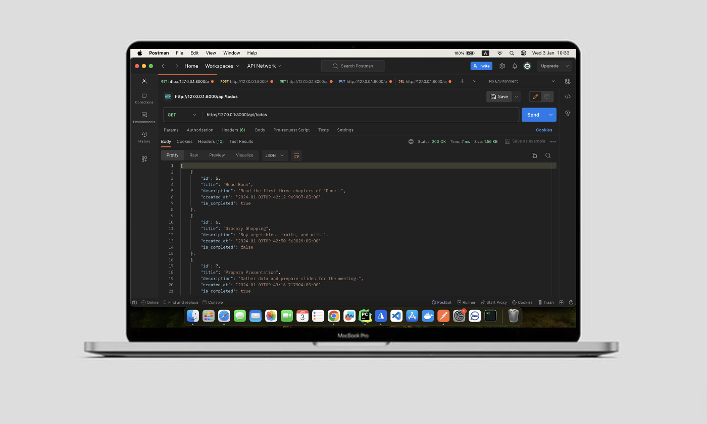
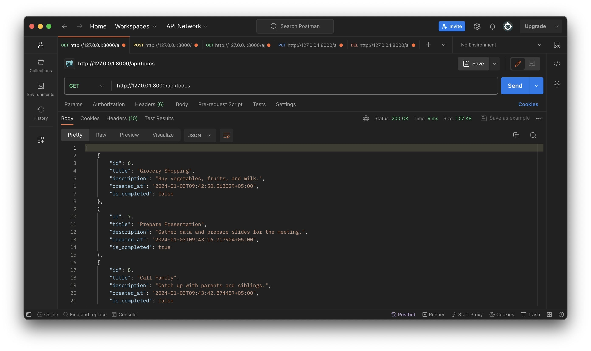
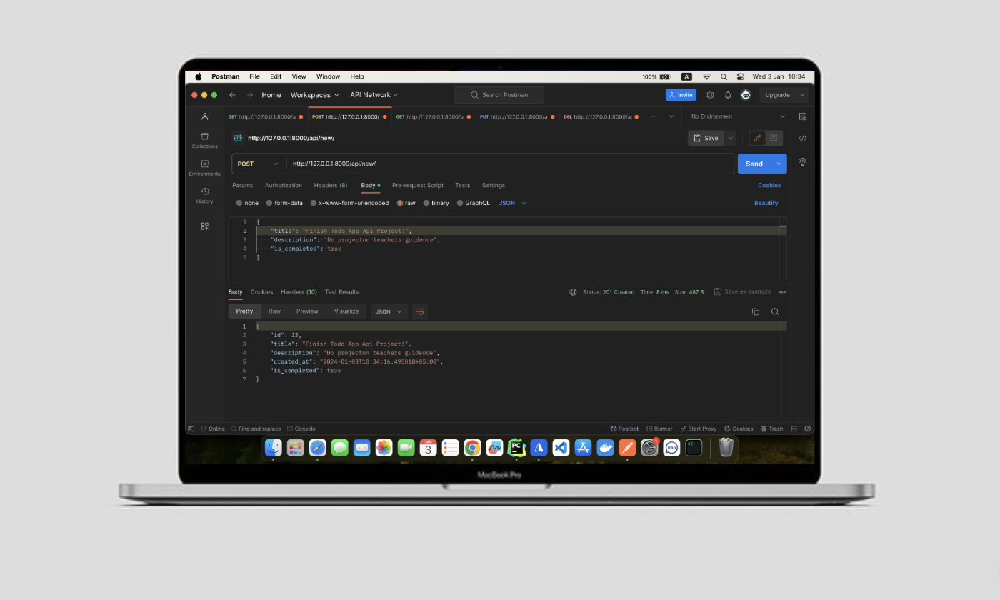
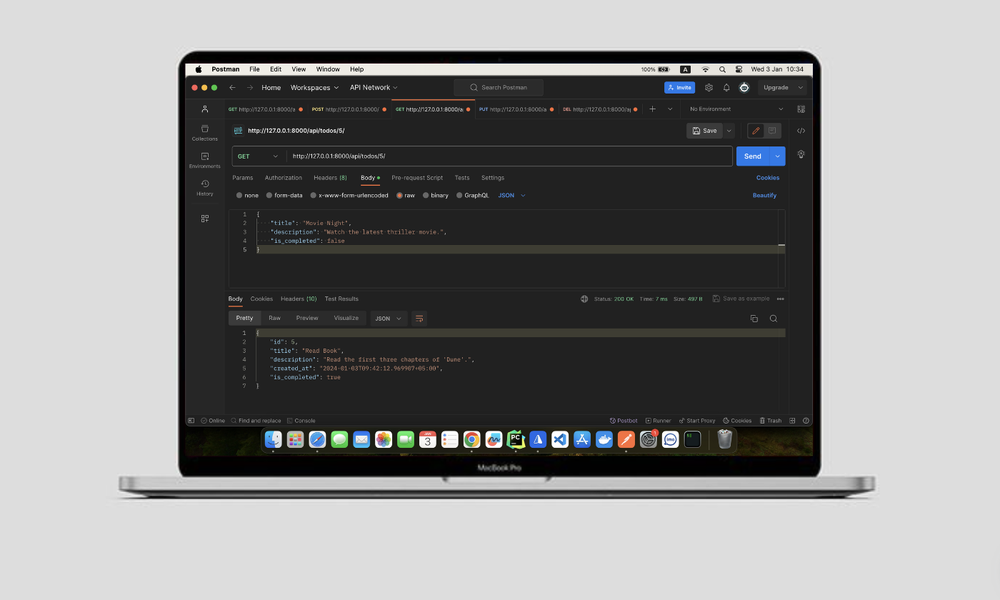
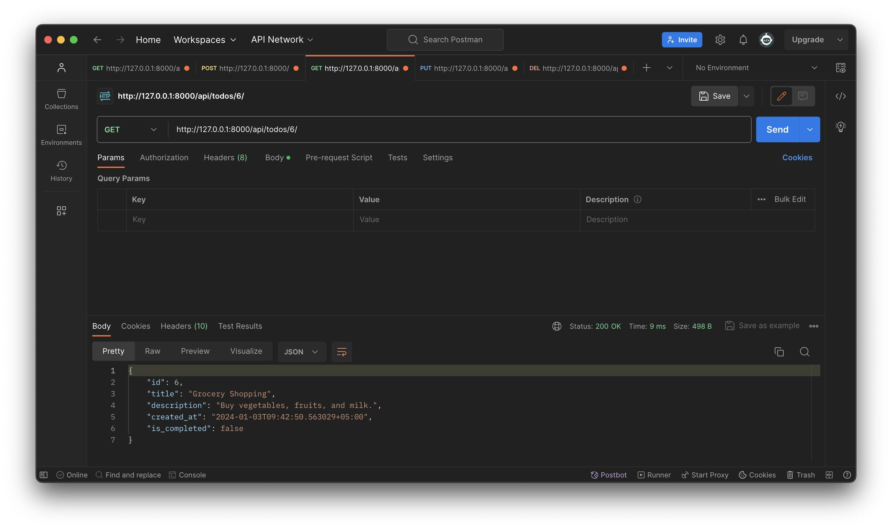
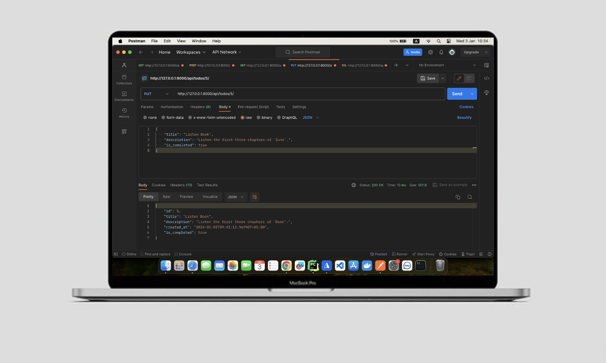
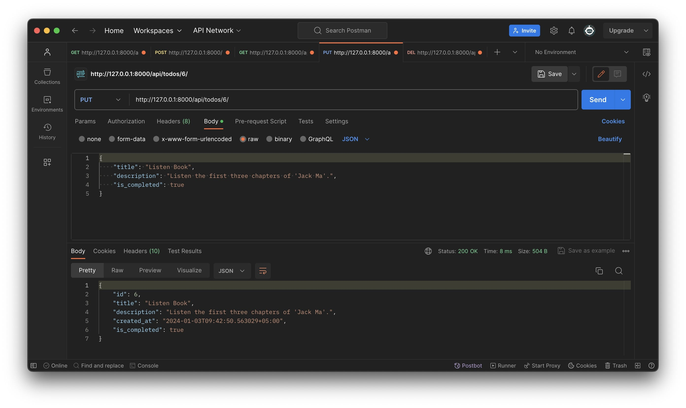
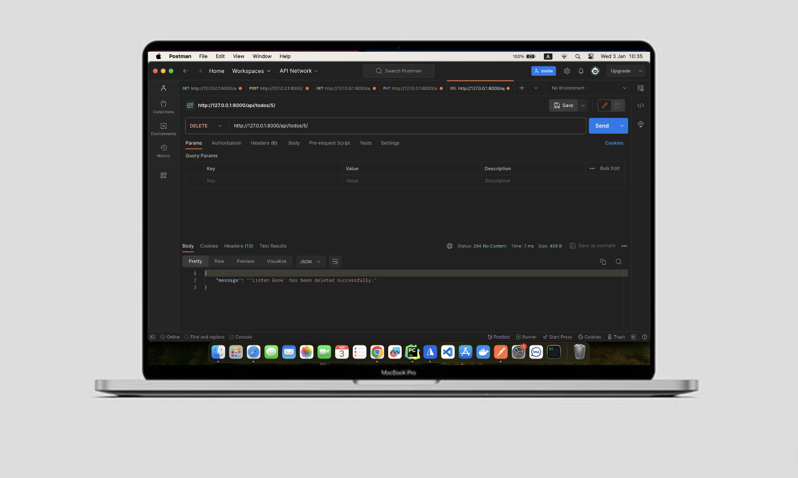
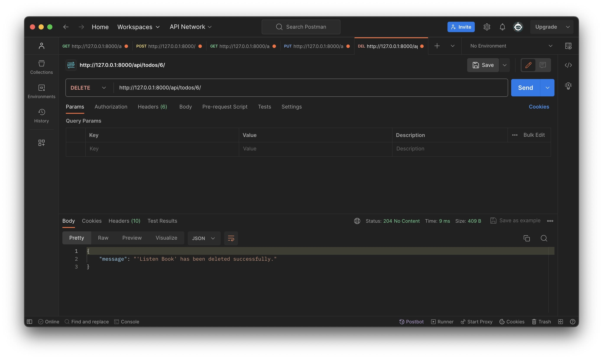

# TodoApp - в `Django Rest Framework`
## RESTful API для приложения Todo

## Желаем приятного Чтения

> Добро пожаловать в наше приложение для управления задачами! <br>
Это приложение предоставляет простой и удобный RESTful API для управления вашим списком задач (Todos). Воспользуйтесь нашими эндпоинтами для добавления, обновления, удаления и просмотра задач, а также получите список всех задач.











**Пример программы так работает.**

## Использование API
- GET /api/todos/: Получить список всех задач.
- POST /api/new/: Создать новую задачу.
- GET /api/todos/{id}/: Получить информацию о задаче по ее уникальному идентификатору (ID).
- DELETE /api/todos/{id}/: Удалить задачу по ее уникальному идентификатору (ID).
- PUT /api/todos/{id}/: Обновить информацию о задаче по ее уникальному идентификатору (ID).

## Примеры использования
- Получите список всех задач, чтобы ознакомиться с вашим списком дел.
- Добавьте новую задачу, указав заголовок, описание и состояние завершенности.
- Обновите информацию о существующей задаче, внесите изменения в заголовок, описание или состояние завершенности.
- Удалите задачу, которая больше не нужна.

## Инструкции
> Чтобы начать использование API, обратитесь к соответствующим эндпоинтам, указав необходимые параметры в запросах. В случае вопросов или затруднений, обратитесь к документации API для получения дополнительной информации.

Не забывайте сохранять уникальные идентификаторы задач, чтобы в дальнейшем иметь возможность обращаться к ним.


## ✨ Особенности

- Простота использования: Наше API предоставляет простые и интуитивно понятные эндпоинты для создания, обновления, удаления и просмотра задач. Вам не потребуется дополнительных инструкций для начала работы.

- Гибкость запросов: Вы можете создавать, обновлять, удалять и просматривать задачи по их уникальным идентификаторам, а также получать список всех задач сразу.

- Понятные ответы: После выполнения запросов на создание, обновление или удаление задач вы получите соответствующий ответ, подтверждающий успешное выполнение операции.

- Гибкий функционал: API позволяет вам управлять вашими задачами с минимальными усилиями, делая процесс управления задачами более эффективным.


# 🚀 Как начать
## Настройка базы данных
Чтобы корректно настроить базу данных для вашего проекта, следуйте этим инструкциям:

## Шаг 1: Выбор базы данных

1. Определите тип базы данных: `Postgres` или `SQLite`.

## Шаг 2: Изменение настроек

### Для `Postgres`

1. В файле настроек вашего проекта (`settings.py`), убедитесь, что используется `Postgres`:
```python
DATABASES = {
    'default': {
        'ENGINE': 'django.db.backends.postgresql_psycopg2',
        'NAME': 'название_вашей_базы_данных',
        'USER': 'ваше_имя_пользователя',
        'PASSWORD': 'ваш_пароль',
        'HOST': 'localhost',
        'PORT': 5432,
    }
}
```

### Создание базы данных

2. Зайдите в `Postgres` на своем компьютере и создайте новую базу данных для вашего проекта.

## Примечание

Убедитесь, что вы указали корректные данные (`NAME`, `USER`, `PASSWORD`) для вашей базы данных. 


### Если же можете `SQLite` default базу данные использовать:
```python
DATABASES = {
    'default': {
        'ENGINE': 'django.db.backends.sqlite3',
        'NAME': os.path.join(BASE_DIR, 'db.sqlite3'),
    }
}
```

    

# Использование `pipenv` в проекте

Данный проект использует инструмент `pipenv` для управления зависимостями и виртуальным окружением Python.

## Установка `pipenv`

1. Убедитесь, что у вас установлен Python на вашем компьютере.
2. Установите `pipenv`, выполнив следующую команду:
    ```
    $ pip install pipenv
    ```
3. Установите все зависимости проекта, введя команду:
    ```
    $ pipenv install
    ```

Это обеспечит установку всех необходимых пакетов для проекта и создание виртуального окружения. Теперь вы готовы начать работу с проектом!


### Клонирование проекта и установка зависимостей

1. Клонируйте репозиторий:
    ```
    $ git clone https://github.com/Humoyun004/TodoApp_Api.git
    ```
2. Заходите в репозиторий:
    ```
    $ cd TodoApp_Api
    ```

3. Запустите команду `pipenv install`, чтобы создать виртуальное окружение и установить все зависимости из файла `Pipfile.lock`.


# Работа с проектом

Для управления проектом используйте следующие команды:

## Активация виртуального окружения

1. Активируйте виртуальное окружение с помощью команды:
    ```bash
    $ pipenv shell
    ```

2. Для установки новых зависимостей выполните:
    ```bash
    $ pipenv install <название_пакета>
    ```

## Выполнение миграций базы данных

3. Создайте файлы миграции для базы данных:
    ```bash
    $ python manage.py makemigrations
    ```

4. Примените миграции к базе данных:
    ```bash
    $ python manage.py migrate
    ```

## Создание пользователя-администратора

5. Создайте пользователя-администратора, указав имя пользователя, пароль и адрес электронной почты:
    ```bash
    $ python manage.py createsuperuser
    ```

## Запуск приложения

6. Запустите приложение с помощью команды:
    ```bash
    $ python manage.py runserver
    ```

## Выход из среды

7. Для выхода из виртуального окружения выполните:
    ```bash
    $ exit
    ```


# Docker

Для запуска данного проекта с использованием Docker, выполните следующие шаги:

## Шаги для запуска проекта

### 1. Установка Docker

Убедитесь, что на вашем компьютере установлен Docker:

- Если у вас нет Docker, скачайте его с [официального сайта](https://docs.docker.com/get-docker/) и следуйте инструкциям по установке для вашей операционной системы.

# Запуск проекта с использованием Docker

Если вы планируете запустить проект через Docker, следуйте этим шагам:

## Создание и запуск Docker-контейнера

1. Создайте образ Docker, выполните команду:
    ```bash
    $ docker build -t todo_app:1.0 .
    ```

2. Запустите контейнер после успешного создания образа:
    ```bash
    $ docker run -p 1212:8000 todo_app:1.0
    ```

3. Если у вас нет образа в локальном хранилище, вы можете скачать его с Docker Hub:
    ```bash
    $ docker pull python:3.11-alpine
    ```

Теперь ваш проект будет доступен в браузере по адресу `https://localhost:1212/`.

## Запуск проекта без использования Docker

Если вы хотите запустить проект без Docker:

1. Активируйте виртуальное окружение:
    ```bash
    $ pipenv shell
    ```

2. Запустите сервер приложения:
    ```bash
    $ python manage.py runserver
    ```

# 📚 Технологии
- Backend: Python, Django, Django Rest Framework
- База данных: SQLite, PostgreSQL.

## Вклад 🤝 
**Если вы хотите внести свой вклад в развитие приложения  пожалуйста, следуйте этим шагам:**

1. Форкните репозиторий на `GitHub`.
2. Клонируйте ваш форк репозитория на локальную машину.
3. Создайте новую ветку для вашей функции или исправления ошибки.
4. Внесите изменения и сделайте коммиты с описательными сообщениями.
5. Отправьте ваши изменения в ваш форк репозитория.
6. Создайте pull request (запрос на включение) в основной репозиторий.

## Контакты
**Если у вас есть вопросы или предложения относительно приложения, пожалуйста, свяжитесь с нами по адресу `humoyunakbaraliev1@gmail.com` Мы ценим ваше мнение!**


